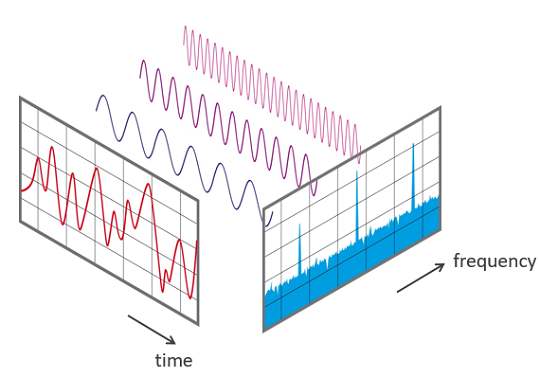
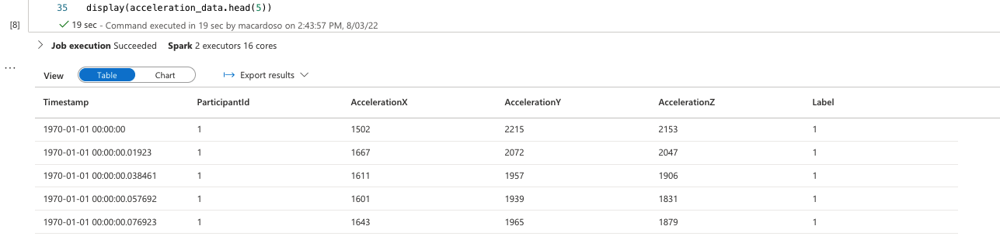
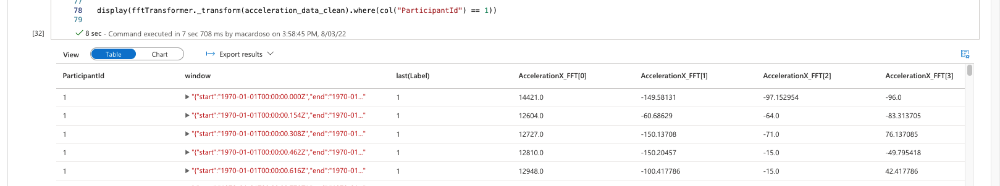
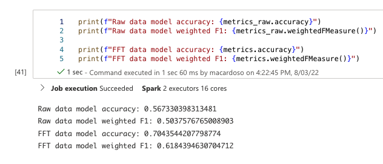

# Feature engineering and Machine Learning with IoT data

In this article, we discuss a feature engineering technique for IoT data using the Fast Fourier Transform.

## Introduction

With the latest advances in ML, a lot of classification and regression problems can be solved with very little effort. Just feed the data to an algorithm (or multiple algorithms in parallel), wait for training, and pick the best model. But IoT data is not that simple. Here’s why.

First, let’s look at what a regular classification problem looks like. Take the Wheat-Seeds dataset, for example. The problem is to determine a seed’s type, based on attributes like area, perimeter, and compactness, etc, which can be observed on the seed itself. Below is a sample of the dataset:
Area | Perimeter | Compactness | Kernel.Length | Kernel.Width | Asymmetry.Coeff | Kernel.Groove | Type |
--- | --- | --- | --- | --- | --- | --- | --- |
15.26 | 14.84 | 871 | 5.763 | 3.312 | 2.221 | 5.22 | 1 |
14.88 | 14.57 | 0.8811 | 5.554 | 3.333 | 1.018 | 4.956 | 1
14.29 | 14.09 | 905 | 5.291 | 3.337 | 2.699 | 4.825 | 1 |
13.84 | 13.94 | 0.8955 | 5.324 | 3.379 | 2.259 | 4.805 | 1 |
... | ... | ... | ... | ... | ... | ... | … |

Notice how the data required to find out the type of seed is **contained in each row**.

How does that compare to an IoT dataset? Take this activity recognition dataset, for example.

SampleId | AccelerationX | AccelerationY | AccelerationZ | Activity |
--- | --- | --- | --- | --- |
1 | 1667 | 2072 | 2047 | 1 |
2 | 1611 | 1957 | 1906 | 1 |
3 | 1601 | 1939 | 1831 | 1 |
4 | 1643 | 1965 | 1879 | 1 |
... | ... | ... | ... | ... |

(You can check out the whole dataset [here](https://archive.ics.uci.edu/ml/datasets/Activity+Recognition+from+Single+Chest-Mounted+Accelerometer))

The problem is similar: predict the activity based on the accelerometer data. But _something’s different here_.

Each row in this dataset represents a time instant - like a picture. Unlike the previous example, **you can’t tell what the subject is doing based on a single data point**. That would be like telling how fast a person is going based off of a picture!

So how do we handle this classification problem?

## Feature engineering to the rescue

One way to work with IoT classification problems (or any kind of time-series classification, really) is to use feature engineering. Through this process, we will perform operations on top of the raw data in order to surface the meaning behind it.

Back to our activity recognition dataset, how can we apply feature engineering?

For each of the original features, let’s take the mean and standard deviation over 10 samples. As for the activity, we’ll take the most common one in each sample range, as an activity shouldn’t change too frequently between samples. Here’s a sample of what the altered dataset might look like:

Sample range | AvgAccelerationX | StdAccelerationX | AvgAccelerationY | StdAccelerationY | AvgAccelerationZ | StdAccelerationZ | Activity |
--- | --- | --- | --- | --- | --- | --- | --- |
1-10 | 1667 | 25 | 2072 | 22 | 2047 | 98 | 1
11-20 | 1611 | 29 | 1957 | 15 | 1906 | 87 | 1
21-30 | 1601 | 42 | 1939 | 21 | 1831 | 105 | 1
31-40 | 1643 | 39 | 1965 | 34 | 1879 | 79 | 1
... | ... | ... | ... | ... | ... | .. | ... |

Now, for each range of samples, we have features that **correlate much more closely with the activity**. It’s easier to tell what each subject is doing by analyzing the measurements over a time window than it is by a single time instant. Besides the mean and standard deviation, there are many **window functions** that can summarize time series data in different ways. This is what we call a **window aggregation**, and is just one of many feature engineering techniques for time-series data.

## The Fast Fourier transform

The Fast Fourier transform is a special window aggregation function that decomposes a time series into periodic components. Like taking a signal - in this case, acceleration - and representing it as the sum of multiple sine waves. The following diagram shows what this decomposition looks like:



Notice how the original signal can be represented as the sum of three sine waves. This means that, in that time window, the signal can be summarized into three coefficients: the amplitude of each of those sine waves. This, of course, assumes our signal is approximately periodic, at least within the time window under analysis. Lucky for us, accelerometer data in activity recognition is falls into that category, as do a lot of IoT datasets! 

The decomposition operation itself is quite complicated, and involves a lot of mathematics. But open source libraries like numpy already have an optimized implementation of it, so we don’t have to get into the ugly details to take advantage of this technique, as long as we know its implications.

The conclusion is that **the Fourier transform can efficiently summarize IoT time-series data**. So it is a very powerful tool for machine learning with IoT data.

## Example

So what does this process look like in the real world? Using an Azure Synapse Spark notebook, we loaded the accelerometer dataset mentioned earlier into a Spark dataframe, and after some minor data cleaning operations, this is what it looks like:



Don’t worry about the timestamp being in 1970 - this is just our Unix time “zero”.

Next, we implemented a Transformer - that’s a Python class that converts a dataframe to a different format - that can perform the Fast Fourier transform to the defined input columns. After transformation, the dataframe looks like this:



Now we have quite a few more columns: eight for each axis of acceleration. We can actually parameterize into how many components we’re splitting each time series, up to the number of samples in the window. The more components, the more accurate the decomposition will be - and the more data we’ll have to process, so be careful!

## Results

Following this transformation, we trained two Random Forest Classification models using Pyspark - one on the original data, and one on transformed data - with some interesting results.



As shown above, our model’s accuracy measure - meaning, how often it gets the subject’s activity right - went from 56.7% to 70.4%, just from applying FFTs for feature engineering. This is by no means the best possible model, but it highlights the value of properly formatting data before starting the modeling process.

## Other resources

Curious about how the whole modeling process works? Check out the full notebook [here!](./accelerometer_modeling.ipynb)!

## References

- https://docs.microsoft.com/en-us/azure/machine-learning/how-to-configure-auto-features
- https://en.wikipedia.org/wiki/Fast_Fourier_transform
- https://en.wikipedia.org/wiki/Feature_engineering
- https://numpy.org/doc/stable/reference/routines.fft.html